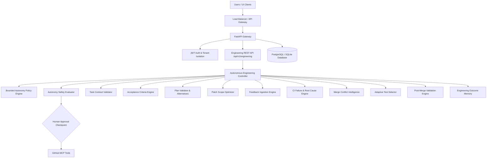

# 🤖 Autonomous Software Engineering & Continuous Feedback Platform (Phase 8)

An advanced, horizontally scalable, durable **Autonomous AI Software Engineering Platform** equipped with Bounded Autonomy Policies (Levels 0-4), Task Contracts, Acceptance Criteria Engines, Plan Validation, Patch Scope Optimization, Feedback Ingestion, CI Failure Stack Trace Analysis, Root Cause Engine, Merge Conflict Intelligence, Regression Risk Prediction, Adaptive Test Selection, Post-Merge Validation, Engineering Outcome Memory, REST API Endpoints, and Streamlit Operations UI.



---

## 🌟 Key Phase 8 Capabilities

1. **Bounded Engineering Controller**: `AutonomousEngineeringController` orchestrates task states (`INTAKE`, `ANALYZING`, `PLANNING`, `APPROVAL_REQUIRED`, `PR_CREATED`, `WAITING_FOR_FEEDBACK`, `REVISION_REQUIRED`, `POST_MERGE_VALIDATION`, `COMPLETED`).
2. **Bounded Autonomy Policy**: Defines explicit autonomy levels (`LEVEL_0` to `LEVEL_4`), allowed tool mutations, iteration caps, and risk thresholds. Unrestricted LEVEL 5 production mutation is strictly prohibited.
3. **Engineering Task Contract & Acceptance Engine**: Validates task contracts (`TaskContract`) and extracts verifiable acceptance criteria (`PASS`, `FAIL`, `UNKNOWN`, `NOT_APPLICABLE`).
4. **Plan Validation & Alternatives**: `PlanValidator` verifies implementation plans against acceptance criteria and formulates plan alternatives (`Approach A: Minimal Patch`, `Approach B: Refactor`, `Approach C: Architectural Change`).
5. **Patch Scope Optimizer**: `PatchOptimizer` evaluates patch scope discipline and produces `PatchScopeReport` enforcing minimal safe patch practices.
6. **Feedback Ingestion & CI Failure Analyzer**: Classifies CI test failures, PR review comments, and merge conflict events. Pinpoints stack trace failure locations and line numbers.
7. **Root Cause Analysis Engine**: `RootCauseEngine` diagnoses root cause hypotheses with evidence citations and confidence levels (`HIGH`, `MEDIUM`, `LOW`, `INSUFFICIENT_EVIDENCE`).
8. **Merge Conflict Intelligence**: Analyzes Git merge conflict markers and enforces mandatory human approval for high-risk files (security, auth, database schemas).
9. **Regression Risk Predictor & Adaptive Test Selector**: Predicts regression risk scores (0–100) and selects test execution plans tailored to modes (`FAST`, `BALANCED`, `DEEP`).
10. **Post-Merge Validation & Outcome Memory**: Verifies merged PRs, invalidates repository cache, re-indexes code graphs, and records long-term task outcome knowledge.

---

## 🚀 Quickstart & Operations

### 1. Install Dependencies & Run Phase 8 Test Suite
```bash
pip install -r requirements.txt
python scratch/test_phase8.py
```

### 2. Run All Regression Suites
```bash
python "C:\Users\tanis\.gemini\antigravity-ide\brain\a0d21763-4f30-4239-bbc8-2fc193056e66\scratch\test_phase4.py"
python "C:\Users\tanis\.gemini\antigravity-ide\brain\a0d21763-4f30-4239-bbc8-2fc193056e66\scratch\test_phase5.py"
python scratch/test_phase6.py
python scratch/test_phase7.py
```

### 3. Launch Streamlit UI
```bash
streamlit run app.py
```

### 4. Launch FastAPI REST API
```bash
uvicorn api.main:app --host 0.0.0.0 --port 8000 --reload
```

---

## 🛡️ Multi-Tenant Security & Bounded Autonomy Safeguards
- **Bounded Autonomy Guarantee**: Autonomy levels (0 to 4) enforce strict limits. Unrestricted production mutation is strictly prohibited.
- **Human Approval Safeguard**: Git write mutations (branch creation, file commits, PR creation/updating) strictly require explicit human approval. Default branches (`main`/`master`) cannot be directly mutated.
- **Untrusted External Data**: All external GitHub data (CI logs, review comments, issue text) is treated as untrusted data and sanitized. System policies cannot be altered by external text.
